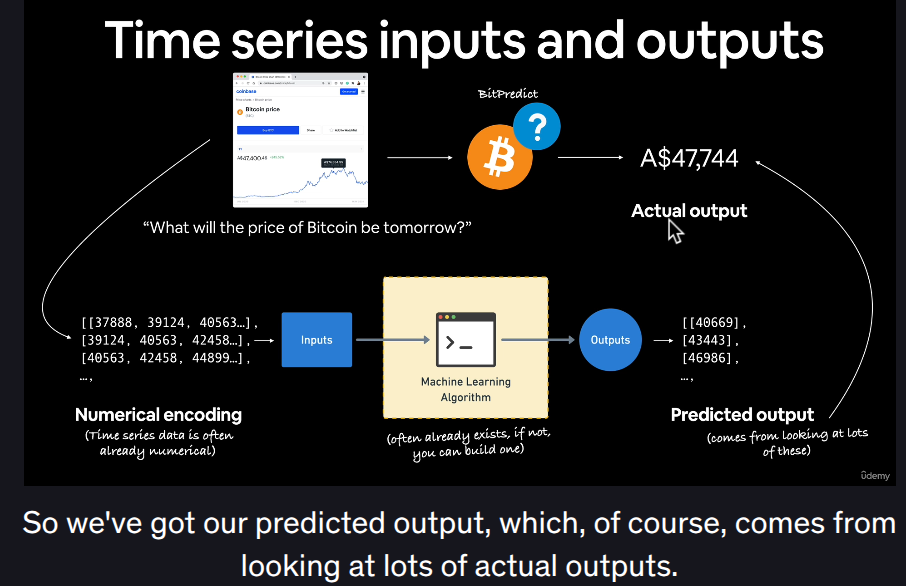
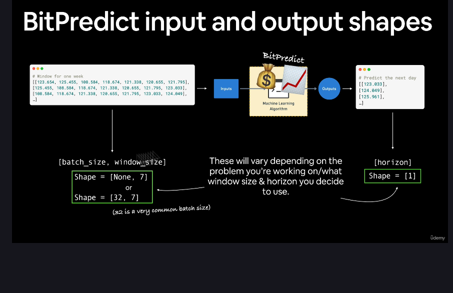

# MileStoneProject_BitPredict
This repository presents a MileStone Project in Deep Learning with TensorFlow.

## Overview
The project focuses on time series forecasting using Long Short-Term Memory (LSTM) networks. The goal is to predict future values based on historical data.

Time series data has a few different things to think about when working with it (we'll see these in the upcoming video).

But the skills you've learned so far will definitely still come into play.

Time series problems deal with anything which has a time component.

Think of:

- *Forecasting the stock price* of Apple tomorrow given historical data

- *Predicting how much electricity* a city will need next month based on the last 5-years of electricity demand

- *Analyzing ECG* (heart monitor) data to detect whether or not a heartbeat is irregular or not

If something has data over time, it can be considered a time series problem.

## What I'll cover in this project
* Download and formatting time series data (the historical price of Bitcoin)

* Writing a *preprocessing function* to prepare the data for a model of time series data

* Setting up *multiple time series modelling experiments* using TensorFlow

* Building a *multivariate model* to take in multivariate time series data.

* *Replicating* the N-BEATS architecture from the paper [N-BEATS: Neural Basis Expansion Analysis for Time Series Forecasting](https://arxiv.org/abs/1905.10437)

* *Making predictions* with the best performing model.

* Demonstrating how to *save and load* a trained model and show the reason why time series forecasting can be BS with the * **turkey problem** *.

## Inputs and Outputs of the model
**Time series inputs and outputs**

When it comes to time series forecasting, there are a few different ways you can set up your inputs and outputs.

**Bit-Predict inputs and outputs**
In this project, we're going to use the historical price of Bitcoin to predict the future price of Bitcoin.

