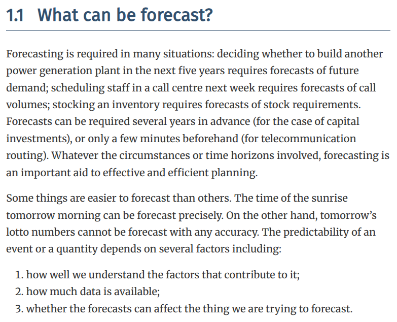

# MileStoneProject_BitPredict
This repository presents a MileStone Project in Deep Learning with TensorFlow.

## Overview
The project focuses on time series forecasting using Long Short-Term Memory (LSTM) networks. The goal is to predict future values based on historical data.

Time series data has a few different things to think about when working with it (we'll see these in the upcoming video).

But the skills you've learned so far will definitely still come into play.

Time series problems deal with anything which has a time component.

Think of:

- *Forecasting the stock price* of Apple tomorrow given historical data

- *Predicting how much electricity* a city will need next month based on the last 5-years of electricity demand

- *Analyzing ECG* (heart monitor) data to detect whether or not a heartbeat is irregular or not

If something has data over time, it can be considered a time series problem.

